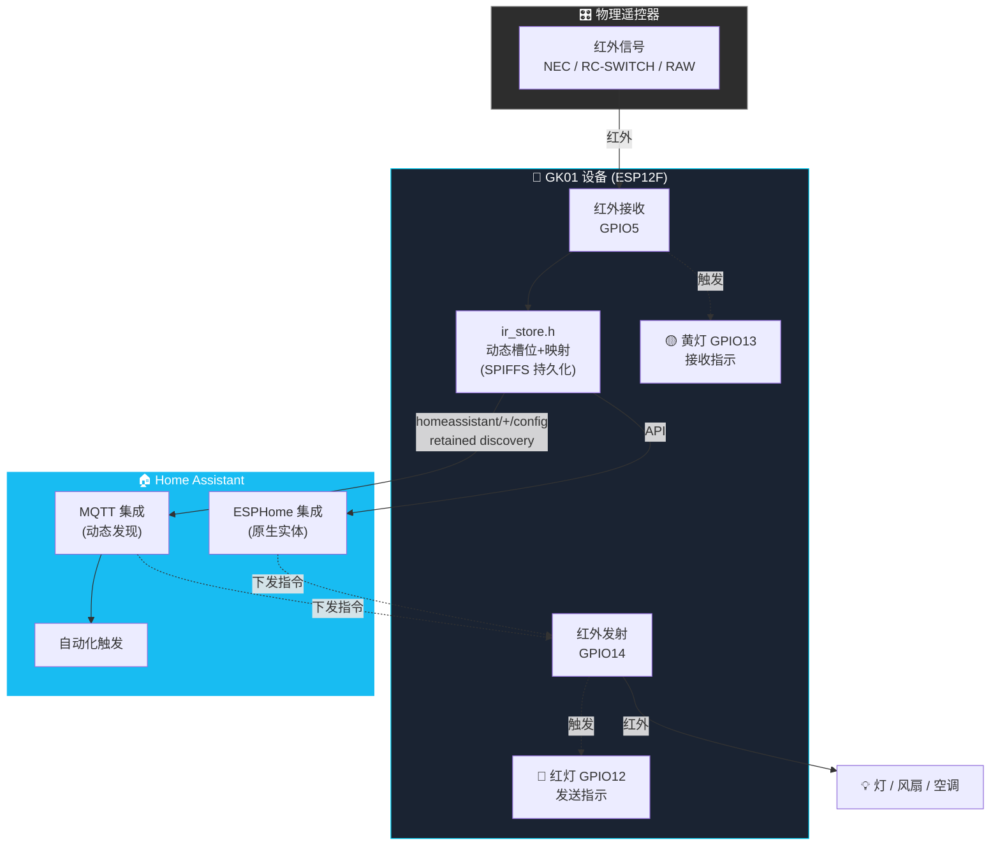
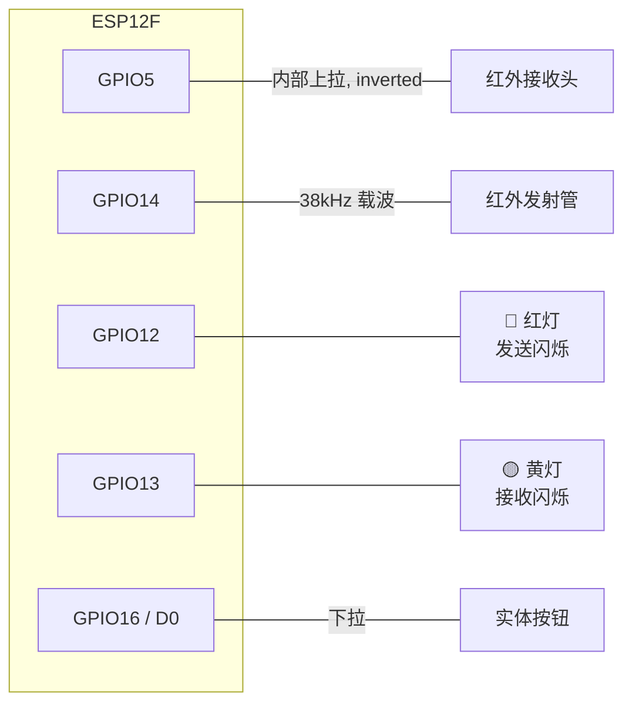
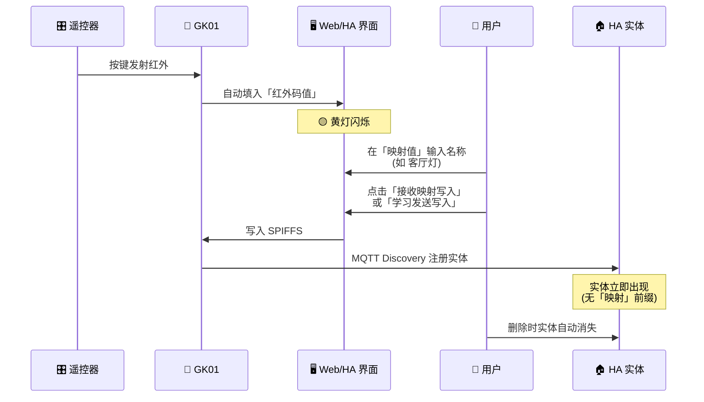

# GK01 红外收发器（ESPHome 固件）

基于 **ESP12F** 芯片的红外学习 + 收发器，支持 **NEC**、**RC-SWITCH**、**RAW** 协议。通过 **ESPHome API** 接入 Home Assistant，同时支持 **MQTT Discovery** 动态创建按钮与映射实体。

> 核心理念：**拒绝固定槽位**，采用动态 `vector + MQTT Discovery` 实现无限实体；**拒绝学习模式状态机**，采用「自动填充 → 人工审查 → 点击保存」模式。

---

## 📐 系统架构



---

## ✨ 功能特性

| 功能 | 说明 |
|------|------|
| 红外接收 | GPIO5，支持 NEC / RC-SWITCH / RAW，自动识别协议 |
| 红外发射 | GPIO14，38kHz 载波，支持 NEC 和 RAW 发射 |
| 自定义映射 | 接收红外码 → 映射自定义值 → 写入 keymap → 作为独立实体显示并触发 HA 自动化 |
| 动态学习 | 接收信号 → 填写名称 → 学习发送写入 → HA 自动创建按钮实体 |
| MQTT Discovery | 学习按钮 + 接收映射均通过 `homeassistant/+/config` 自动注册到 HA，**无数量上限** |
| MQTT 配置持久化 | 地址/端口/用户名/密码保存到 Flash，重启不丢失 |
| 周期补发兜底 | `script + 30s interval` 周期重发 retained discovery，断网重连/重启自动恢复全部实体 |
| 状态指示 | 黄灯 = 接收信号，红灯 = 发送信号 |
| 名称查重 | 接收映射值与发送按键名**全局唯一**，重名时拒绝写入并提示「名称重复」 |

---

## 🔌 硬件接线



| 功能 | GPIO | 说明 |
|------|------|------|
| 红外接收 | GPIO5 | 带内部上拉，inverted |
| 红外发射 | GPIO14 | 载波 38kHz |
| 红灯 | GPIO12 | 发送时闪烁 |
| 黄灯 | GPIO13 | 接收时闪烁 |
| 按钮 | GPIO16 | D0，下拉 |

---

## 🔄 工作流程（自动填充 + 手动保存）



---

## 📁 项目文件

| 文件 | 说明 |
|------|------|
| `gk01.yaml` | ESPHome 主配置 |
| `ir_store.h` | 动态槽位 + 映射存储库（SPIFFS） |
| `gk01_0630_v1.1.0.bin` | 最新编译固件（v1.1.0） |

---

## 🖥️ 界面说明（web 端 / HA）

从上到下：

1. 运行时间 / WiFi 信号
2. 启动信息 / **MQTT 连接状态**
3. 槽位数量 / 发送槽位列表 / 接收映射列表
4. 红外事件计数器 / 红外码状态
5. MQTT 地址 / 用户名 / **密码（隐藏）** / 端口
6. 红外码值 / 映射值(发送值)
7. 接收映射写入 / 学习发送写入 / 删除发送按键 / 删除映射 / 重启

接收映射实体在 HA 中以独立 sensor 显示，例如：

| HA 实体 | 红外码 |
|---|---|
| GK01 IR Remote test | NEC:4040:F10E |
| GK01 IR Remote 阳台灯 | NEC:9B44:BE41 |
| GK01 IR Remote 客厅风扇 | NEC:9B44:EF10 |
| GK01 IR Remote 客厅灯 | NEC:9B44:F10E |

---

## 📝 使用流程

### 接收映射（触发 HA 自动化）

1. 按遥控器 → 红外码自动填入「红外码值」
2. 在「映射值」输入自定义名称（如 `客厅灯`）
3. 点击「接收映射写入」
4. HA 中出现同名独立实体，后续收到该红外码即可触发自动化

### 学习发送按键（HA 中生成按钮）

1. 按遥控器 → 红外码自动填入「红外码值」
2. 在「映射值」输入按钮名称（如 `空调开关`）
3. 点击「学习发送写入」
4. HA 自动出现同名按钮，点击即可发射该红外信号

### 删除

- 「删除发送按键」：填红外码或名称 → 删除并清除 HA 实体
- 「删除映射」：填红外码或映射值 → 删除 keymap

---

## 🏠 接入 Home Assistant

### 方式一：ESPHome 集成（API）

HA 设置 → 集成 → 添加 ESPHome → 输入设备 IP → 自动发现所有实体

### 方式二：MQTT 集成（动态按钮 / 映射）

确保 HA 已配置 MQTT 集成。学习按钮与接收映射均自动通过 `homeassistant/+/gk01_*/config` 注册，并由 30s interval 周期补发兜底。

---

## ⚙️ 编译 / 刷写

```bash
esphome compile gk01.yaml
esphome upload --device gk01.local gk01.yaml
```

或直接用 **ESPHome Web** 刷入 `gk01_0630_v1.1.0.bin`：
https://web.esphome.io/

> ⚠️ **Docker 用户注意**：ESPHome 容器若把 `/mnt/media/docker/esphome` 挂载到 `/config`，则必须在容器内子目录路径编译：`cd /config/gk01 && esphome compile gk01.yaml`，否则会编译到根目录的废弃版本。

---

## 🏷️ 固件版本

| 版本 | 时间 | 说明 |
|------|------|------|
| `gk01_0630_v1.2.0.bin` | 2026-06-30 | 接收映射值与发送按键名全局查重，禁止重名 |
| `gk01_0630_v1.1.0.bin` | 2026-06-30 | 映射实体名去掉「映射」前缀，仅保留名称；同步最新 OTA 固件 |
| `gk01_0629_0007.bin` | 2026-06-29 | API 接入 + MQTT 持久化 + 红黄灯指示 + 动态学习 |

---

## 作者

summmer121
